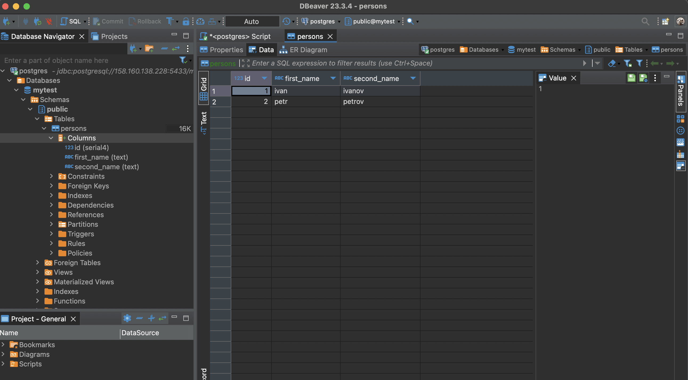

#Домашнее задание: Установка и настройка PostgteSQL в контейнере Docker
Цель:
    установить PostgreSQL в Docker контейнере
    настроить контейнер для внешнего подключения


- [Домашнее задание: Установка и настройка PostgteSQL в контейнере Docker](#домашнее-задание-установка-и-настройка-postgtesql-в-контейнере-docker)
  - [Cоздать ВМ с Ubuntu 20.04/22.04 или развернуть докер любым удобным способом](#cоздать-вм-с-ubuntu-20042204-или-развернуть-докер-любым-удобным-способом)
  - [Поставить на нем Docker Engine](#поставить-на-нем-docker-engine)
  - [Сделать каталог /var/lib/postgres](#сделать-каталог-varlibpostgres)
  - [Развернуть контейнер с PostgreSQL 15 смонтировав в него /var/lib/postgresql](#развернуть-контейнер-с-postgresql-15-смонтировав-в-него-varlibpostgresql)
  - [Развернуть контейнер с клиентом postgres](#развернуть-контейнер-с-клиентом-postgres)
  - [Подключиться из контейнера с клиентом к контейнеру с сервером и сделать таблицу с парой строк](#подключиться-из-контейнера-с-клиентом-к-контейнеру-с-сервером-и-сделать-таблицу-с-парой-строк)
  - [Подключиться к контейнеру с сервером с ноутбука/компьютера извне инстансов GCP/ЯО/места установки докера](#подключиться-к-контейнеру-с-сервером-с-ноутбукакомпьютера-извне-инстансов-gcpяоместа-установки-докера)
  - [Удалить контейнер с сервером](#удалить-контейнер-с-сервером)
  - [Создать его заново](#создать-его-заново)
  - [Подключится снова из контейнера с клиентом к контейнеру с сервером](#подключится-снова-из-контейнера-с-клиентом-к-контейнеру-с-сервером)
  - [Проверить, что данные остались на месте](#проверить-что-данные-остались-на-месте)


## Cоздать ВМ с Ubuntu 20.04/22.04 или развернуть докер любым удобным способом
Yandex cloud vm Ubuntu 22.04 LTS


## Поставить на нем Docker Engine
```bash
sudo apt  install docker.io
```
## Сделать каталог /var/lib/postgres

```bash
nevanna@otus:~/var/lib/postgres$ pwd
/home/nevanna/var/lib/postgres
```

## Развернуть контейнер с PostgreSQL 15 смонтировав в него /var/lib/postgresql
```bash
#качаем образ на машину
sudo docker pull postgres:15.0

nevanna@otus:~$ sudo docker images
REPOSITORY   TAG       IMAGE ID       CREATED         SIZE
postgres     15.0      027eba2e8939   16 months ago   377MB
```


```bash
sudo docker run --name otus -e POSTGRES_PASSWORD=12345  -e POSTGRES_DB=mytest -e PGDATA=/var/lib/postgresql/data/pgdata -v /home/nevanna/var/lib/postgres:/var/lib/postgresql/data --publish 5433:5432 -d postgres:15.0


nevanna@otus:~$ sudo docker ps
CONTAINER ID   IMAGE           COMMAND                  CREATED         STATUS         PORTS                                       NAMES
2e57ec75d7d8   postgres:15.0   "docker-entrypoint.s…"   2 minutes ago   Up 2 minutes   0.0.0.0:5433->5432/tcp, :::5433->5432/tcp   otus


sudo docker exec -it 2e57ec75d7d82219302a2df79d088b74b45564f3b2e9a0685774cdc7eabdcb42 bash
root@2e57ec75d7d8:/# psql -U postgres
psql (15.0 (Debian 15.0-1.pgdg110+1))
Type "help" for help.

postgres=# \l
                                                List of databases
   Name    |  Owner   | Encoding |  Collate   |   Ctype    | ICU Locale | Locale Provider |   Access privileges
-----------+----------+----------+------------+------------+------------+-----------------+-----------------------
 mytest    | postgres | UTF8     | en_US.utf8 | en_US.utf8 |            | libc            |
 postgres  | postgres | UTF8     | en_US.utf8 | en_US.utf8 |            | libc            |
 template0 | postgres | UTF8     | en_US.utf8 | en_US.utf8 |            | libc            | =c/postgres          +
           |          |          |            |            |            |                 | postgres=CTc/postgres
 template1 | postgres | UTF8     | en_US.utf8 | en_US.utf8 |            | libc            | =c/postgres          +
           |          |          |            |            |            |                 | postgres=CTc/postgres
(4 rows)


```

```
#подключаемся к базе в контейнере с вируталки
nevanna@otus:~$ psql -h localhost -p 5433 -U postgres
Password for user postgres:


#смотрим что созданная база через интерактивный терминал контейнера нам видна
postgres=# \l
                                                      List of databases
   Name    |  Owner   | Encoding | Locale Provider |  Collate   |   Ctype    | ICU Locale | ICU Rules |   Access privileges
-----------+----------+----------+-----------------+------------+------------+------------+-----------+-----------------------
 mytest    | postgres | UTF8     | libc            | en_US.utf8 | en_US.utf8 |            |           |
 postgres  | postgres | UTF8     | libc            | en_US.utf8 | en_US.utf8 |            |           |
 template0 | postgres | UTF8     | libc            | en_US.utf8 | en_US.utf8 |            |           | =c/postgres          +
           |          |          |                 |            |            |            |           | postgres=CTc/postgres
 template1 | postgres | UTF8     | libc            | en_US.utf8 | en_US.utf8 |            |           | =c/postgres          +
           |          |          |                 |            |            |            |           | postgres=CTc/postgres
(4 rows)

```


## Развернуть контейнер с клиентом postgres

```bash
nevanna@otus:~$ sudo docker run --name client -e POSTGRES_PASSWORD=12345 -d postgres:15.0
5d59500081462d8dc9e8cf3a3a116b9849a088a76bcd0cb077630f0255fe2f59
nevanna@otus:~$ sudo docker ps -a
CONTAINER ID   IMAGE           COMMAND                  CREATED          STATUS          PORTS                                       NAMES
5d5950008146   postgres:15.0   "docker-entrypoint.s…"   6 seconds ago    Up 5 seconds    5432/tcp                                    client
2e57ec75d7d8   postgres:15.0   "docker-entrypoint.s…"   20 minutes ago   Up 20 minutes   0.0.0.0:5433->5432/tcp, :::5433->5432/tcp   otus
```

## Подключиться из контейнера с клиентом к контейнеру с сервером и сделать таблицу с парой строк
Чтобы можно было ходить из одного контейнера в другой, нам необходимо создать сеть
```bash
# создаем сеть
nevanna@otus:~$ sudo docker network create myNetwork
50a2c2575bb1b5e66cec372e111ea5fa8f6e1c10b2d9047514911a7381217e0d

nevanna@otus:~$ sudo docker network connect myNetwork 2e57ec75d7d8
nevanna@otus:~$ sudo docker network connect myNetwork 5d5950008146
```
```bash
nevanna@otus:~$ sudo docker network inspect myNetwork
[
    {
        "Name": "myNetwork",
        "Id": "50a2c2575bb1b5e66cec372e111ea5fa8f6e1c10b2d9047514911a7381217e0d",
        "Created": "2024-02-18T17:03:35.199162372Z",
        "Scope": "local",
        "Driver": "bridge",
        "EnableIPv6": false,
        "IPAM": {
            "Driver": "default",
            "Options": {},
            "Config": [
                {
                    "Subnet": "172.18.0.0/16",
                    "Gateway": "172.18.0.1"
                }
            ]
        },
        "Internal": false,
        "Attachable": false,
        "Ingress": false,
        "ConfigFrom": {
            "Network": ""
        },
        "ConfigOnly": false,
        "Containers": {
            "2e57ec75d7d82219302a2df79d088b74b45564f3b2e9a0685774cdc7eabdcb42": {
                "Name": "otus",
                "EndpointID": "a703de44dda359f20b41909990022f828d68ac69a3b81bc0c043e5d475af79e9",
                "MacAddress": "02:42:ac:12:00:02",
                "IPv4Address": "172.18.0.2/16",
                "IPv6Address": ""
            },
            "5d59500081462d8dc9e8cf3a3a116b9849a088a76bcd0cb077630f0255fe2f59": {
                "Name": "client",
                "EndpointID": "e8ae58006ed9864495685fbe04e27d412f78c4d2036d8f0d4a0a82122c905c54",
                "MacAddress": "02:42:ac:12:00:03",
                "IPv4Address": "172.18.0.3/16",
                "IPv6Address": ""
            }
        },
        "Options": {},
        "Labels": {}
    }
]

```

```bash
# подключаемся
nevanna@otus:~$ sudo docker exec -it 5d5950008146 bash
root@5d5950008146:/# psql -h 172.18.0.2 -p 5432 -U postgres
Password for user postgres:
psql (15.0 (Debian 15.0-1.pgdg110+1))
Type "help" for help.

postgres=# \l
                                                List of databases
   Name    |  Owner   | Encoding |  Collate   |   Ctype    | ICU Locale | Locale Provider |   Access privileges
-----------+----------+----------+------------+------------+------------+-----------------+-----------------------
 mytest    | postgres | UTF8     | en_US.utf8 | en_US.utf8 |            | libc            |
 postgres  | postgres | UTF8     | en_US.utf8 | en_US.utf8 |            | libc            |
 template0 | postgres | UTF8     | en_US.utf8 | en_US.utf8 |            | libc            | =c/postgres          +
           |          |          |            |            |            |                 | postgres=CTc/postgres
 template1 | postgres | UTF8     | en_US.utf8 | en_US.utf8 |            | libc            | =c/postgres          +
           |          |          |            |            |            |                 | postgres=CTc/postgres
(4 rows)


postgres=#
#подключаемся к нашей базе
postgres=# \c mytest
You are now connected to database "mytest" as user "postgres".

# создаем таблицу и наполняем ее
mytest=# create table persons(id serial, first_name text, second_name text);
CREATE TABLE
mytest=# insert into persons(first_name, second_name) values('ivan', 'ivanov');
INSERT 0 1
mytest=# insert into persons(first_name, second_name) values('petr', 'petrov');
INSERT 0 1
mytest=# select * from persons;
 id | first_name | second_name
----+------------+-------------
  1 | ivan       | ivanov
  2 | petr       | petrov
(2 rows)

```

## Подключиться к контейнеру с сервером с ноутбука/компьютера извне инстансов GCP/ЯО/места установки докера
подключаюсь с личного компа (не из облака и контейнера) с использованием DBeaver
```bash
jdbc:postgresql://{публичный адрес виртуалки}:5433/mytest
```


## Удалить контейнер с сервером
```bash
nevanna@otus:~$ sudo docker stop 2e57ec75d7d8
2e57ec75d7d8

nevanna@otus:~$ sudo docker rm 2e57ec75d7d8
2e57ec75d7d8
```

## Создать его заново
```bash
sudo docker run --name otus -e POSTGRES_PASSWORD=12345  -e POSTGRES_DB=mytest -e PGDATA=/var/lib/postgresql/data/pgdata -v /home/nevanna/var/lib/postgres:/var/lib/postgresql/data --publish 5433:5432 -d postgres:15.0

25dbcd6ce95f55f79aea6ffad8358dbf49d29bbf893ef54f5c7091a87e6e5c3f
```

## Подключится снова из контейнера с клиентом к контейнеру с сервером
```bash
# добавляем в сеть
nevanna@otus:~$ sudo docker network connect myNetwork 25dbcd6ce95f

nevanna@otus:~$ sudo docker inspect myNetwork
[
    {
        "Name": "myNetwork",
        "Id": "50a2c2575bb1b5e66cec372e111ea5fa8f6e1c10b2d9047514911a7381217e0d",
        "Created": "2024-02-18T17:03:35.199162372Z",
        "Scope": "local",
        "Driver": "bridge",
        "EnableIPv6": false,
        "IPAM": {
            "Driver": "default",
            "Options": {},
            "Config": [
                {
                    "Subnet": "172.18.0.0/16",
                    "Gateway": "172.18.0.1"
                }
            ]
        },
        "Internal": false,
        "Attachable": false,
        "Ingress": false,
        "ConfigFrom": {
            "Network": ""
        },
        "ConfigOnly": false,
        "Containers": {
            "25dbcd6ce95f55f79aea6ffad8358dbf49d29bbf893ef54f5c7091a87e6e5c3f": {
                "Name": "otus",
                "EndpointID": "35525f021f26d7be97322ded39e38d8d3a4d85314be5a85e749f56f559e84a1c",
                "MacAddress": "02:42:ac:12:00:02",
                "IPv4Address": "172.18.0.2/16",
                "IPv6Address": ""
            },
            "5d59500081462d8dc9e8cf3a3a116b9849a088a76bcd0cb077630f0255fe2f59": {
                "Name": "client",
                "EndpointID": "e8ae58006ed9864495685fbe04e27d412f78c4d2036d8f0d4a0a82122c905c54",
                "MacAddress": "02:42:ac:12:00:03",
                "IPv4Address": "172.18.0.3/16",
                "IPv6Address": ""
            }
        },
        "Options": {},
        "Labels": {}
    }
]

```

## Проверить, что данные остались на месте
```bash
nevanna@otus:~$ sudo docker exec -it 5d5950008146 bash

root@5d5950008146:/# psql -h 172.18.0.2 -U postgres -d mytest
Password for user postgres:
psql (15.0 (Debian 15.0-1.pgdg110+1))
Type "help" for help.

mytest=# select * from persons;
 id | first_name | second_name
----+------------+-------------
  1 | ivan       | ivanov
  2 | petr       | petrov
(2 rows)
```

